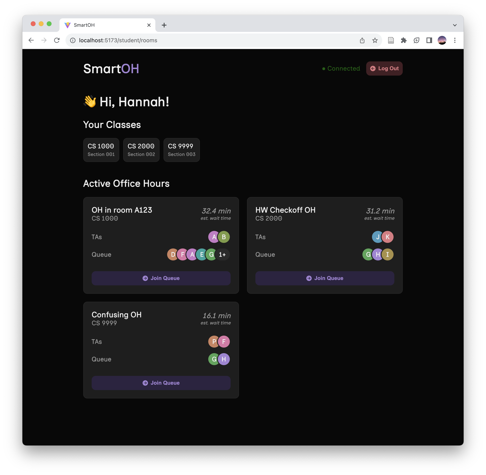
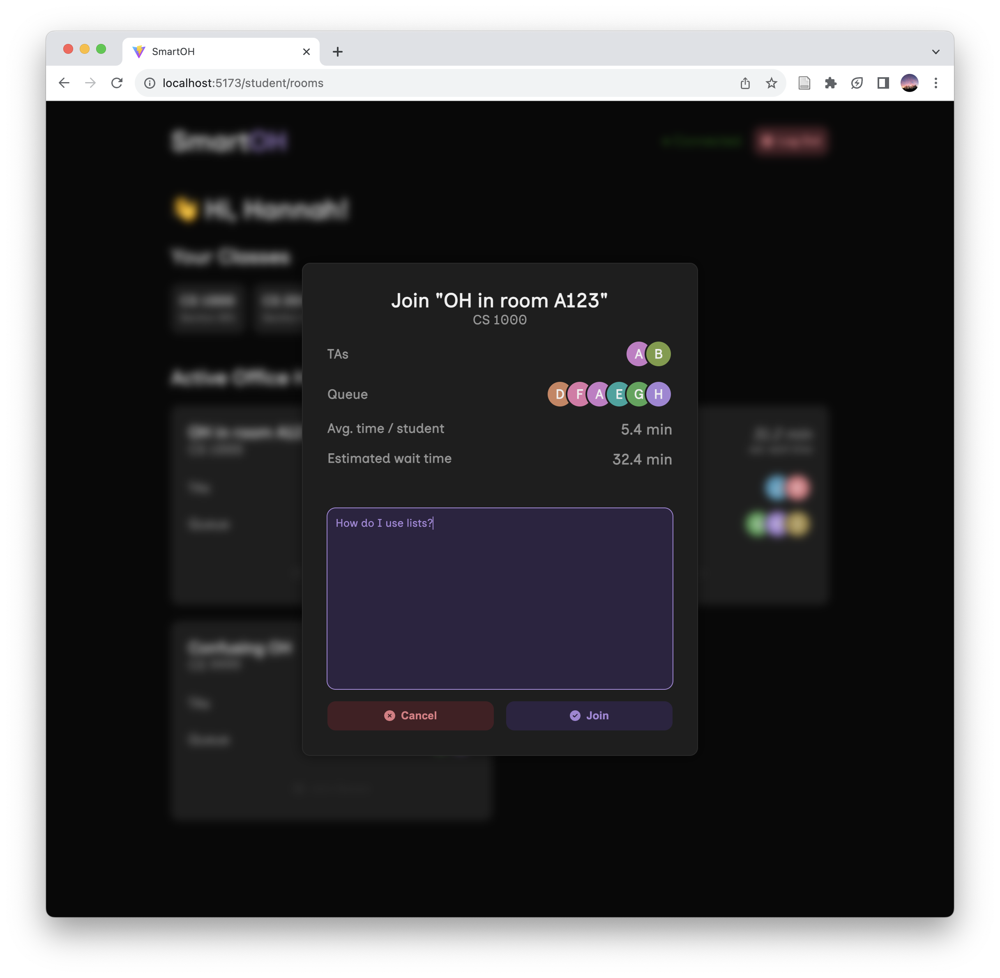
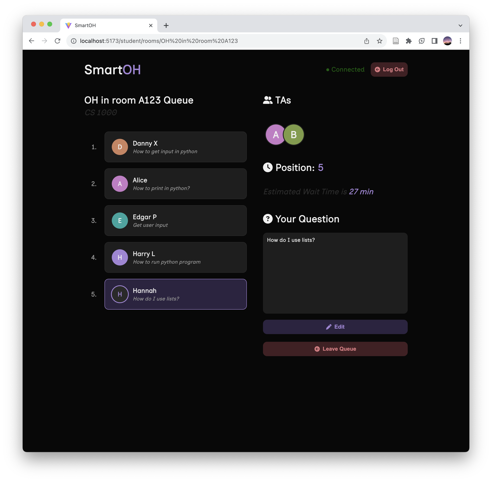
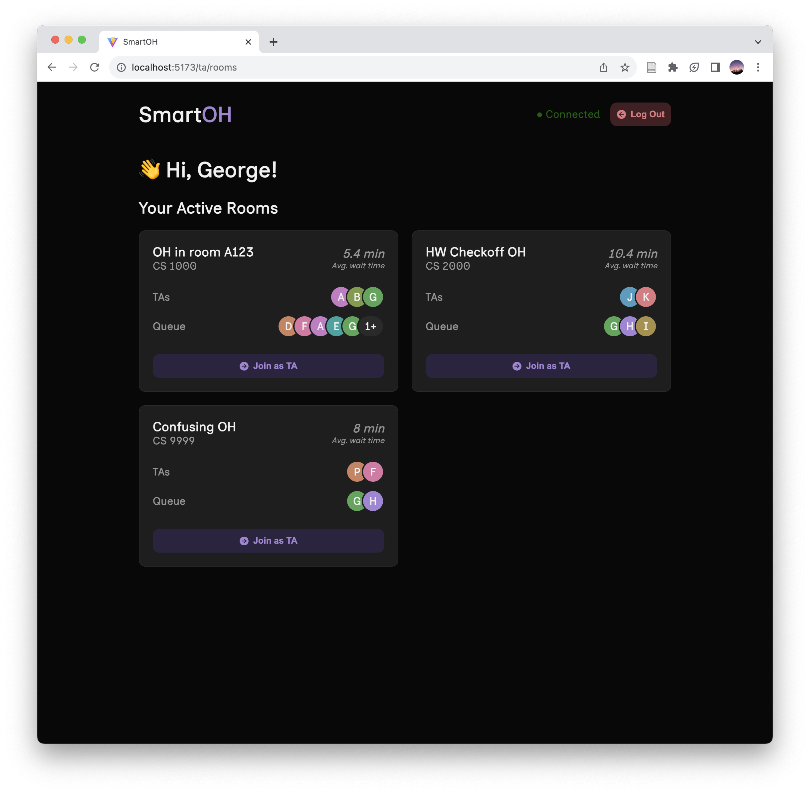
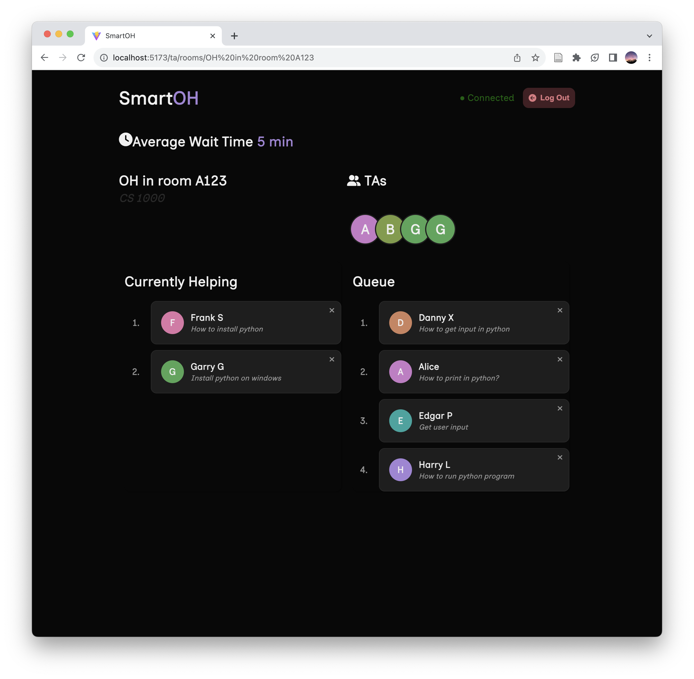

# Smart Office Hours


Smart Office Hours aims to simplify the coordination between students and teaching assistants during office hours. Utilizing cutting-edge technology, we make it easy for students to get the help they need while optimizing TA efficiency using AI, data analytics, and a robust tech stack.

## Table of Contents

1. [Opportunity](#the-opportunity-for-smartoh)
2. [Benefits](#the-benefits-of-our-approach)
3. [Tech Stack](#our-tech-stack)
4. [Data Workflow](#our-data-workflow)
5. [Functionality](#functionality)
    - [For Students](#functionality-for-students)
    - [For TAs](#functionality-for-tas)
6. [Installation and Running](#installation-and-running)
7. [Usage](#usage)
8. [Contributing](#contributing)
9. [License](#license)

---

### The Opportunity for SmartOH


The current situation in educational institutions requires a better-managed system for office hours. SmartOH addresses this need effectively.

---

### The Benefits of Our Approach


Our unique approach offers various benefits such as ease of use, real-time updates, and an optimized queue management system.

---

### Our Tech Stack


We utilize a robust tech stack to ensure scalability and performance.

---

### Our Data Workflow


Our data workflow guarantees data integrity and seamless experience for both TAs and students.

---

## Functionality

### Functionality for Students





Students can easily join rooms, ask questions, and see their queue status.

---

### Functionality for TAs




TAs can manage multiple rooms and see all queued questions easily.

---

## Installation and Running

Make sure you have the latest version of [Node.js](https://nodejs.org/en/) installed. You will need [npm](https://www.npmjs.com/) to install the dependencies and run the app.
We also recommend using a Python virtual environment to run the AI microservices.

Here are the steps to get the app up and running:

```bash
# Clone the repository
git clone https://github.com/YourUsername/SmartOH.git

# Navigate into the directory
cd SmartOH

# Start SmartOH!
./run.sh
```

---

## Usage

Explain here how users can take advantage of the features of SmartOH.

---

## Contributing

If you'd like to contribute to the project, please read our [Contributing Guidelines](CONTRIBUTING.md).

---

## License

This project is licensed under the MIT License - see the [LICENSE.md](LICENSE.md) file for details.
