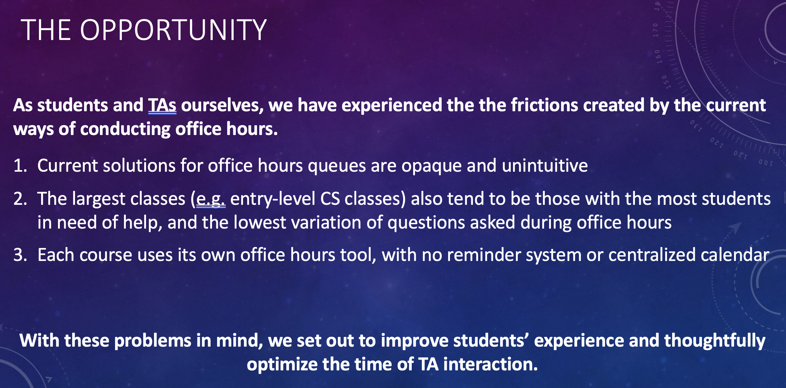
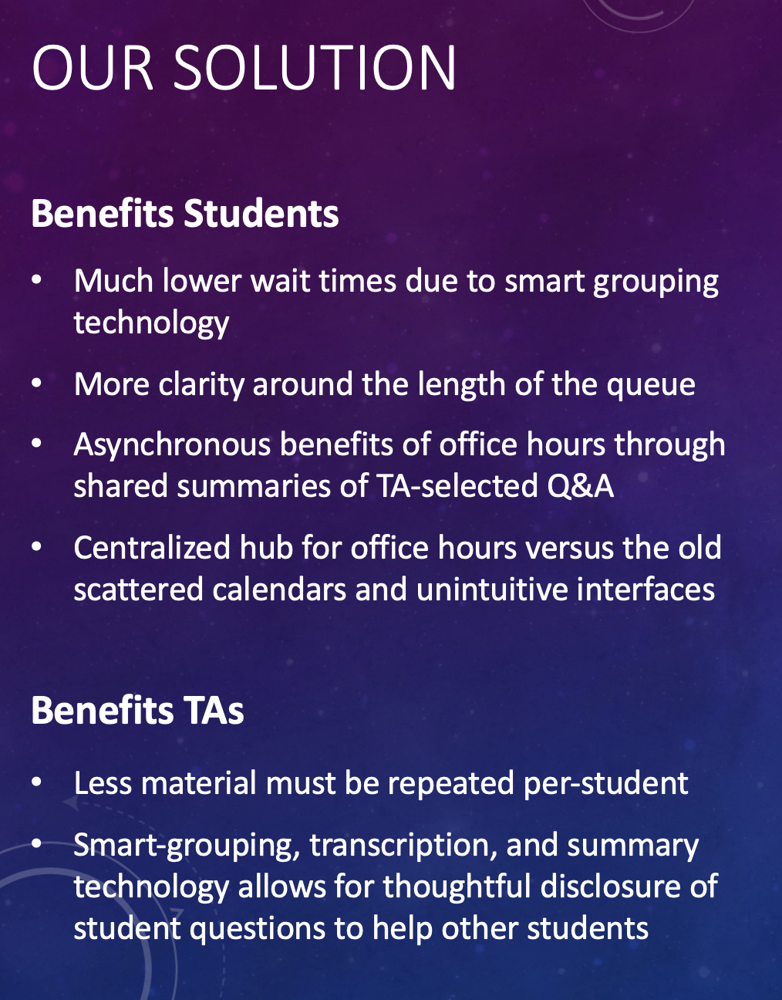
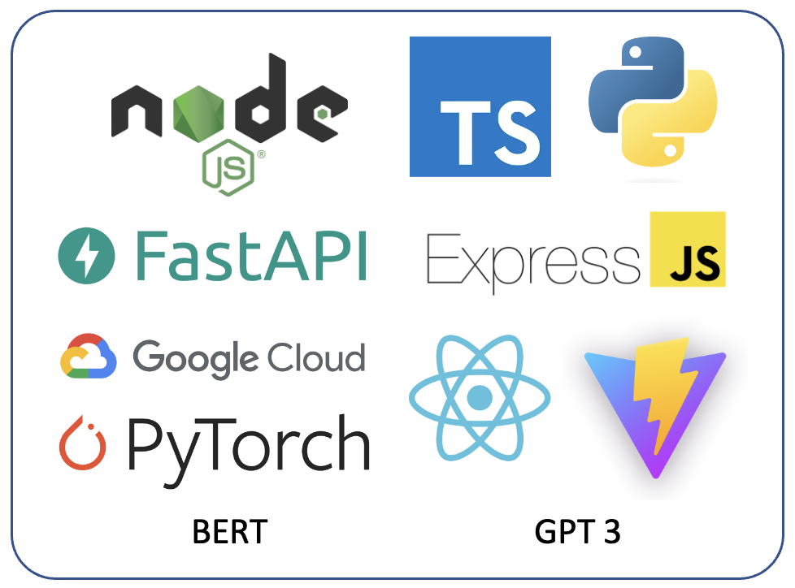
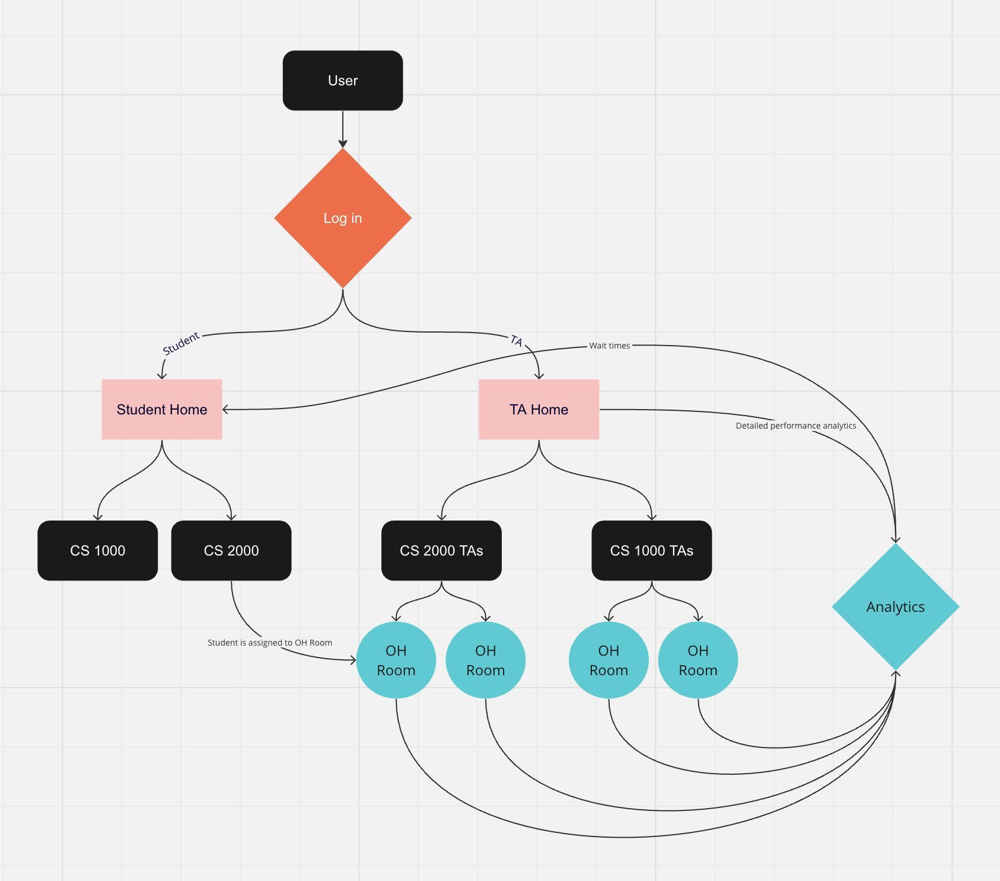
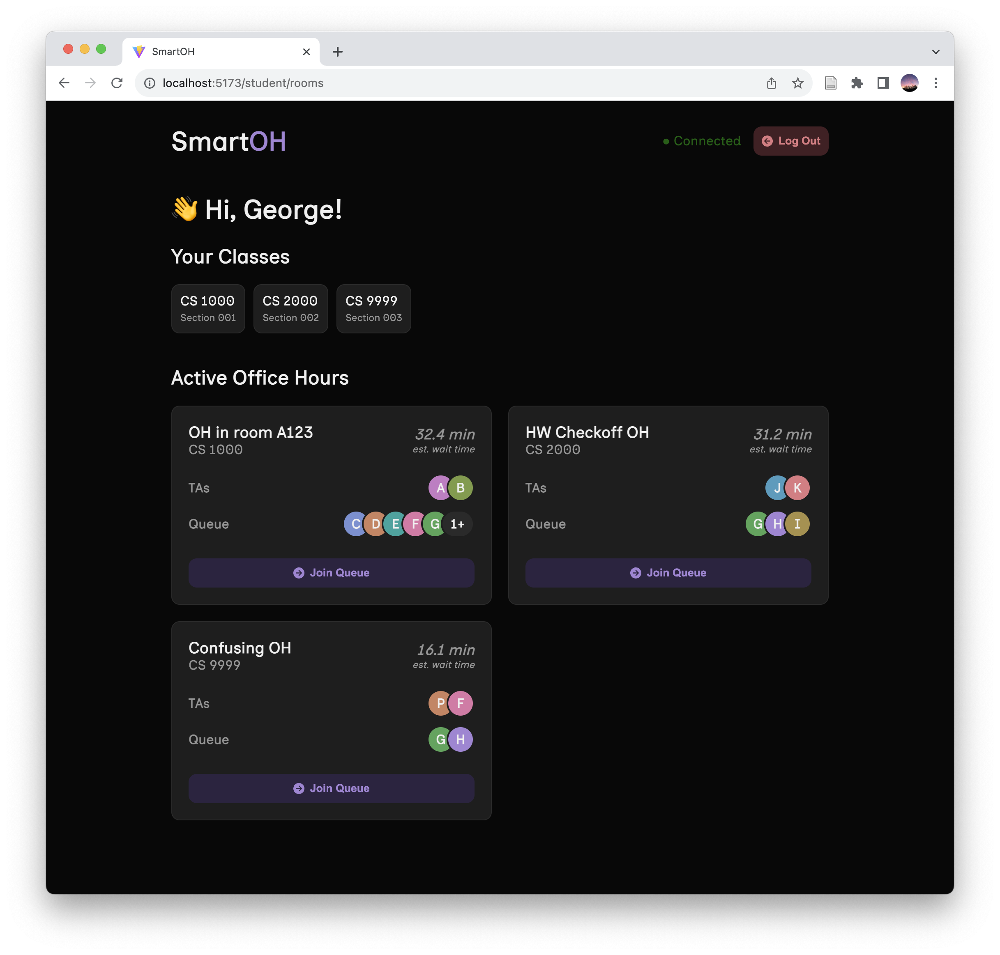
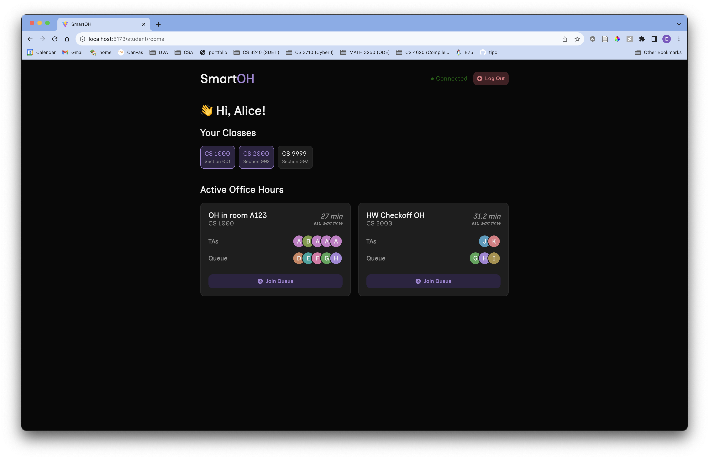
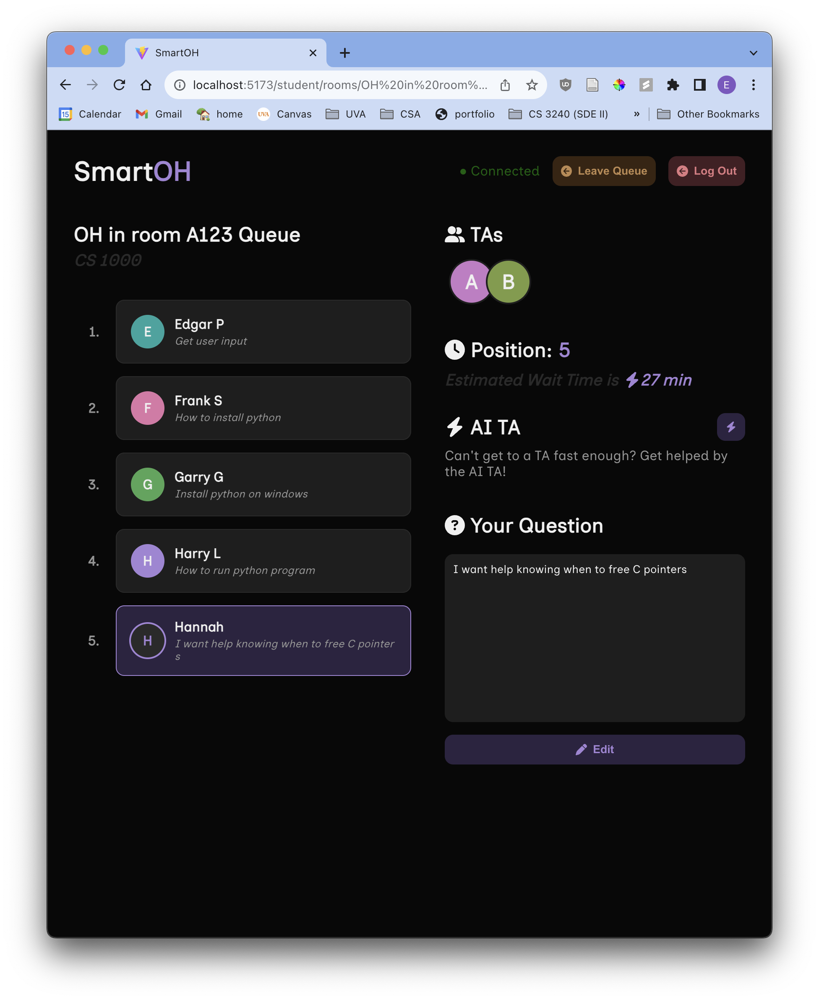
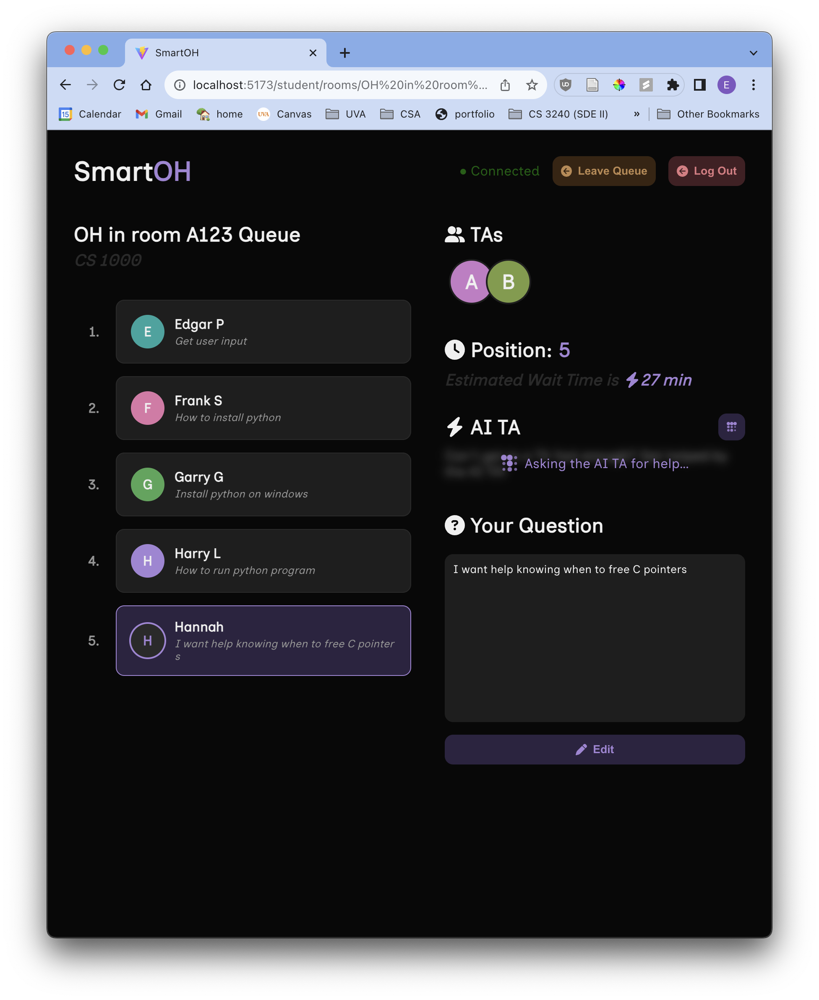
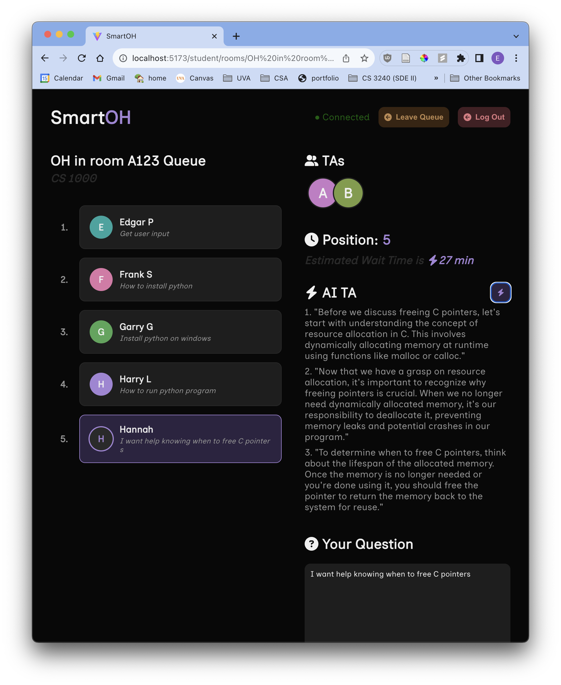
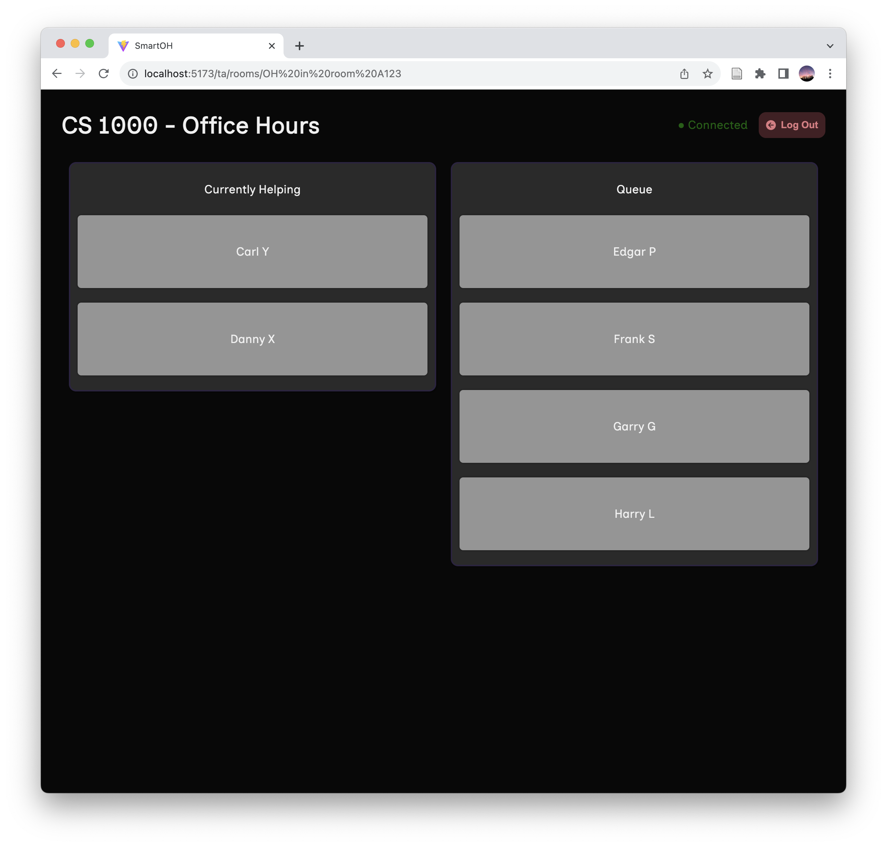

# Smart Office Hours

### The Opportunity for SmartOH

### The Benefits of Our Approach

### Our Tech Stack

### Our Data Workflow

Login Splash. A tab is used to select if you are a TA or a student!
### Functionality for Students

The student landing page shows live previews of the status of each Office Hour room, along with AI-powered predictions for wait times.

Students can also easily filter their office hours by class!

To join the Queue, a student must enter their question.

A student can view relevant data while waiting in the queue, such as their position, wait time, and who the TAs and other students are.

If a TA isn't available, ask the AI TA for help!

The AI TA isn't a full substitute for a real TA, but it can definitely make a TA's life easier by explaining basic concepts.

### Functionality for TAs

The TA landing page is similar, except that TAs do not join the Queue nor need to ask questions.

<!--  -->