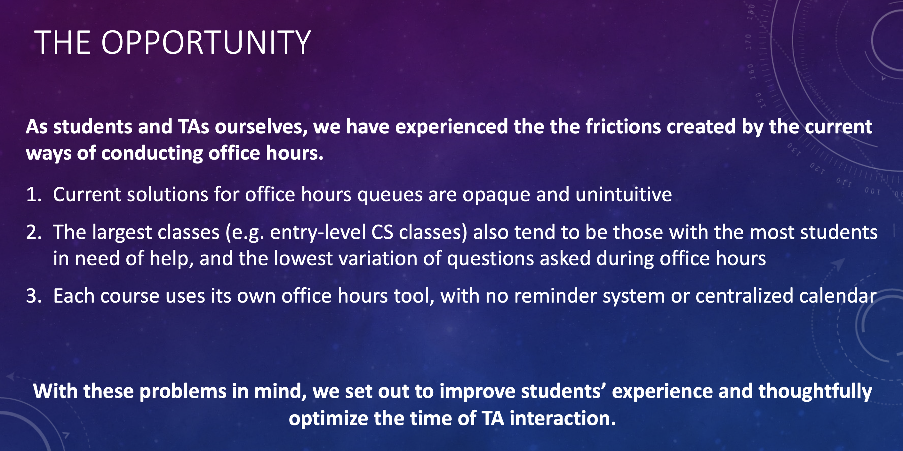

# Smart Office Hours

Smart Office Hours aims to simplify the coordination between students and teaching assistants during office hours. Utilizing cutting-edge technology, we make it easy for students to get the help they need while optimizing TA efficiency using AI, data analytics, and a robust tech stack.

## Table of Contents

1. [Opportunity](#the-opportunity-for-smartoh)
2. [Benefits](#the-benefits-of-our-approach)
3. [Tech Stack](#our-tech-stack)
4. [Data Workflow](#our-data-workflow)
5. [Functionality](#functionality)
    - [For Students](#functionality-for-students)
    - [For TAs](#functionality-for-tas)
6. [Installation and Running](#installation-and-running)
7. [Usage](#usage)
8. [License](#license)

---

### The Opportunity for SmartOH

The current situation in educational institutions requires a better-managed system for office hours. SmartOH addresses this need effectively.

---

### The Benefits of Our Approach

Our unique approach offers various benefits such as ease of use, real-time updates, and an optimized queue management system.

---

### Our Tech Stack

We utilize a robust tech stack to ensure scalability and performance.

---

### Our Data Workflow

Login Splash. A tab is used to select if you are a TA or a student!
### Functionality for Students

The student landing page shows live previews of the status of each Office Hour room, along with AI-powered predictions for wait times.

Students can also easily filter their office hours by class!

To join the Queue, a student must enter their question.

A student can view relevant data while waiting in the queue, such as their position, wait time, and who the TAs and other students are.

If a TA isn't available, ask the AI TA for help!

The AI TA isn't a full substitute for a real TA, but it can definitely make a TA's life easier by explaining basic concepts.

### Functionality for TAs

The TA landing page is similar, except that TAs do not join the Queue nor need to ask questions.

<!--  -->
